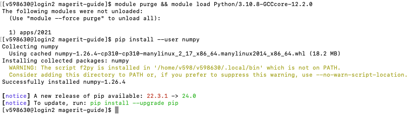
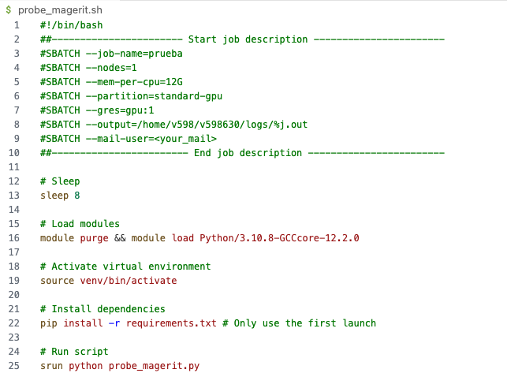

# CeSviMa magerit first steps tutorial
## Table of contents
1. [Steps to request access for CeSVima](#steps-to-request-access-for-cesvima)

    1.1. [Go to CeSVima webpage](#step-1---acces-cesvima-webpage)

    1.2. [Access the Form](#step-2---access-the-form)

    1.3. [E-mail received](#step-3---e-mail-received)

2. [Magerit walkthrough](#magerit-walkthrough)

    2.1. [Add magerit to your ssh aliases](#add-magerit-to-your-ssh-aliases-in-sshconfig)

    2.2. [Generate ssh key on your computer](#generate-ssh-key-on-your-computer)

    2.3. [Access the HPC using the ssh magerit command](#now-you-can-access-the-hpc-using-the-ssh-magerit-command)

    2.4. [To list currently loaded modules](#to-list-currently-loaded-modules)

    2.5. [To list all the available modules to install](#to-list-all-the-available-modules-to-install)

    2.6. [To list all available modules of a given framework](#to-list-all-available-modules-of-a-given-framework-run-the-command)

    2.7. [To restart your environment](#to-restart-your-environment)

3. [Launch a test program](#launch-a-test-program)

    3.1. [Clone the following repository](#1-clone-the-following-repository)

    3.2. [Open probe_magerit.sh. You should see the following](#2-open-probe_mageritsh-you-should-see-the-following)

    3.3. [Access the venv using](#3-access-the-venv-using)

    3.4. [Run the following command to install the required dependencies](#4-run-the-following-command-to-install-the-required-dependencies)

    3.5. [Run the following command to run the script](#5-run-the-following-command-to-run-the-script)

    3.6. [Check if the script has been queued](#6-check-if-the-script-has-been-queued)

    3.7. [Check the output of the script](#7-check-the-output-of-the-script)

    3.8. [Cancel a job](#8-cancel-a-job)

## Steps to request access for CeSVima

### STEP 1 - Acces CeSVima webpage
Refer to the following [link](https://www.cesvima.upm.es/services/hpc/magerit). Hopefully you will see the following page:


### STEP 2 - Access the Form
Click on the **Solicitud** button.
Fill with all the corresponding information about your supervisor, the department and yourself.
Take into account that for your supervisor information just the email is mandatory and for the address use the one of the university (Av. Complutense, 30. 28040).
The information corresponding to the department is presented below. 

 

**NOTE**:
If you are a PhD student, fill project data with your PhD thesis information(Thesis title, overview of the topic and so on...). If you do not have a title and a description yet, you can fill it with a general description of your research area and a title :wink:.

**NOTE 2**:
Maximum project duration is up to 2 years.
Therefore, select from the current day plus 2 years.

### STEP 3 - E-mail received

After a few days, you will receive an email similar to the one in the figure below with your username and password.


## Magerit walkthrough

Since the given password is difficult to remember, it is possible to modify it following the steps provided in the email attached to previous section.
However, for an easier access without using the password we recommend to perform the following steps (ssh):

### **Add magerit to your ssh aliases** in .ssh/config


### Generate **ssh key on your computer**
Run the following command:
``ssh-keygen``
(**NOTE**: For further information i.e. specify filename or the key algorithm refer to [this tutorial](https://www.ssh.com/academy/ssh/keygen).)

### Now you can **access** the HPC using the ``ssh magerit`` command.

Here you have accessed an interactive node, which is not used for computation, but just to interact with the really powerful nodes.
The folders are shared across nodes.
The following folders are available:

* **Project**: folder with shared data for people within your project (if you belong to any).
In case of being related with your thesis, you will be the only user of it.

* **Scratch**: folder to store temporary files.

* **User**: folder to store personal files.

For more information refer to the [storage documentation](https://docs.cesvima.upm.es/magerit/magerit3/#almacenamiento).

There is 1TB storage for the whole project (/home/`)`


### **To list currently loaded modules:**
```bash
modules list
```


### **To list all the available modules to install:**
```bash
module avail
```


### **To list all available modules of a given framework run the command:**
```bash
 module spider <framework-to-list>
```
Some examples are presented below:


### **To restart your environment**
You may also consider restarting your environment before loading any module. That can be done directly using the following combination of instructions. The **module load** command will be executed after **module purge** which unloads all modules loaded in your environment.

```bash
 module purge & module load <module-to-load>
```



**IMPORTANT NOTE:** There are errors when loading <span style="color:red">**Python3.11**</span> so please avoid using it. For instance, you might not be able to run pip install commands. For now, <span style="color:green">**Python3.10**</span> is the latest stable version available.

As commented, interactive nodes (where our commands will be executed) do not have a GPU associated. Therefore, **nvidia-smi** command will prompt the following:

```bash
nvidia-smi
```


It is possible to directly install modules using pip or any other apart from those listed using previous commands. In our case, the remaining install commands will be executed directly in those nodes specified for computation as it will be shown later in [Launch a test program](#launch-a-test-program) section so we leave it for now.


However, if you experience problems directly installing a module using pip after loading the corresponding module, you may consider restarting your evironment and loading a different Python version. An exampple of the error you may get is presented below:


## **Launch a test program**

For this section, we recommend using VSCode for accessing **magerit**. It simplifies the process of editing and running the scripts. You can also use the terminal directly.

### 1. Clone the following repository:
```bash
git clone https://github.com/imartinf/magerit-guide.git
```


### 2. Open probe\_magerit.sh. You should see the following:

This is the main script that includes all the principal processes that will be involved in the execution of the test program. However, you can launch them independently in the terminal as it will be shown. However, for simplicity we recommend to include them in the script.




**NOTE:** Slurm is used for launching all the commands that will be sent to the computation nodes. Slurm reads commands in the way presented above, beginning with “#” (i.e. #sbatch). Therefore, although they will appear as comments, they will work.

Before running anything, open a terminal and go to the directory where you have cloned the repository. Create a virtual environment to install the required packages for this demo. You can do this by running the following command:

```bash
python -m venv venv
```


**NOTE:** python must have been loaded prior to running this command. You can check it by running [“module list”](#to-list-currently-loaded-modules) command.

The steps presented from this point on will be executed when launching **probe_magerit.sh**. You can try to run them on a terminal directly if you want to check the output of each command. However, a description of each of the steps is presented below for a better understanding of the process.

### 3. Access the venv using:

```bash
source venv/bin/activate
```

### 4. Run the following command to install the required dependencies:

This command will install all the required dependencies for the script to run. It can be done manually in the shell or you can also include it in the script as shown in the [probe_magerit.sh](#2-open-probe_mageritsh-you-should-see-the-following) file.

```bash
pip install -r requirements.txt
```

### 5. Run the following command to run the script:


In order to run commands, as presented at the end of the script, you should include “srun”. A general example is provided:

```bash
sbatch <your_file.sh> --<your-arguments>
```

**NOTE:** optional arguments in this case refers to slurm arguments. For instance, you can specify the number of nodes, the number of tasks, the time, the partition, etc. For further information refer to the [slurm documentation](https://slurm.schedmd.com/sbatch.html).

Open **probe\_magerit.py**, you should see the following:


This file is a simple script that will run a test program to check if the environment is correctly set up and that will describe relevant information regarding the environment and the resources available. It will be executed in the computation nodes. It will be executed from the **probe_magerit.sh** script.

To run the script, execute the following command:

```bash
sbatch probe_magerit.sh
```

### 6. Check if the script has been queued:

To check if the script has been queued, you can run the following command:

```bash
squeue
```
In the following image, you can see that the script has been queued and is waiting until it can be processed.


Once it enters in the running state, you should see the following:


### 7. Check the output of the script:

Once the script has finished, you can check the output in the file **output.out**. To visualize the output, you can use the following commands:

```bash
# List directories
ls
# Go to logs directory
cd logs/
# Print the output of the script in the terminal
cat output.out
```

In this **.out** file you will see everything that your code prints in the terminal. As you do not have access to the terminal where the code is running, this is the only way to see the output of your code. However, you can use any other loggers to save the output of your code in a file or in a remote framework.
At first you should see all the requirements installation and other information related to different processes carried out at the beginning of the execution.


In the end, you should be able to see the output of the script in the terminal with all the relevant information which should be similar to the following:


### 8. Cancel a job

If you want to cancel a job that is currently being executed, you can use the following command:

```bash
scancel <job_id>
```

Where **<job_id>** is the id of the job you want to cancel. You can get the id of the job by running the following command:

```bash
squeue
```


